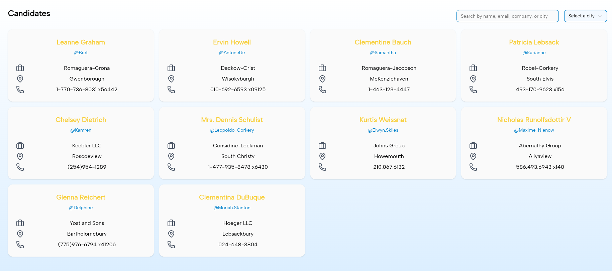
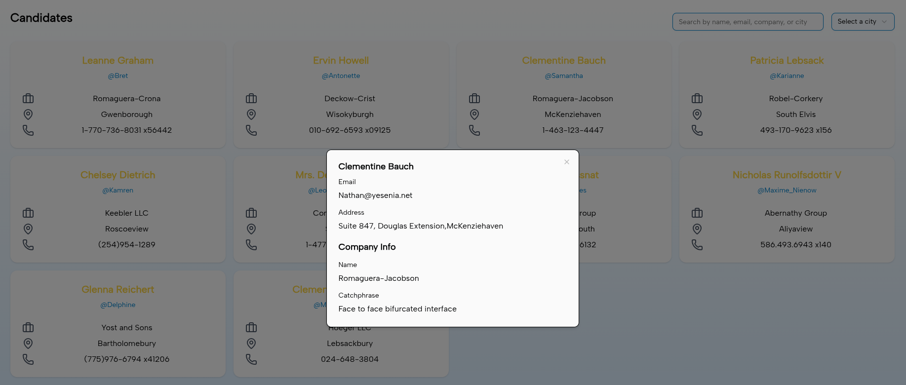

# Candidate Browser

View the live page [here](https://candidate.waiyan13.com).

Deployed to Cloudflare Pages via GitHub Actions.

## Screenshots






## Running Locally

### Pre-requisities

- Docker

Navigate to project root directory and run this command.

```shell
source ./build.sh
```

The page will be available at `http://localhost:3000`

## Concepts Applied

### General

- Atomic Design
- Domain-based Project Structure
- Component Library

### React

- [ErrorBoundary](https://react.dev/reference/react/Component#catching-rendering-errors-with-an-error-boundary) (for showing fallback component on errors)
- [Suspense](https://react.dev/reference/react/Suspense) (for showing fallback components on external network requests)

## Notable Libraries

- [Ky](https://github.com/sindresorhus/ky) (Fetch-based HTTP client)
- [Tanstack Query](https://tanstack.com/query/latest) (Managing server state)
- [React Hook Form](https://react-hook-form.com) (Form Management)
- [Base UI](https://base-ui.com/) (Base component library)
- [tailwindcss](https://tailwindcss.com) (Styling)
- [Testing Library](https://testing-library.com) (Usage based testing)
